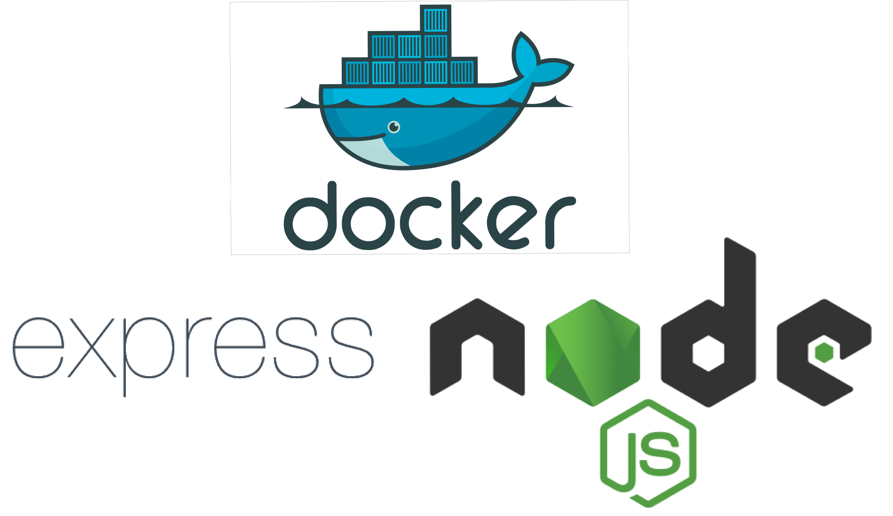

    

This repository contains a simple docker "project".
It runs a small express app on "http://localhost:3000" address and it contains 3 routes: "http://localhost:3000/", "http://localhost:3000/docker" and "http://localhost:3000/author".
